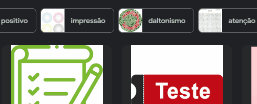

# projeto com readme
Um projeto de teste com um arquivo README 🚀 

[]

## tecnologias usadas 
- HTML
- CSS
- JV

## como utilizar

1-Crie uma pasta e abra o gitbash nela

2-Digite esse comando e no final bote a url do projeto.
``````
git clone <url>
``````